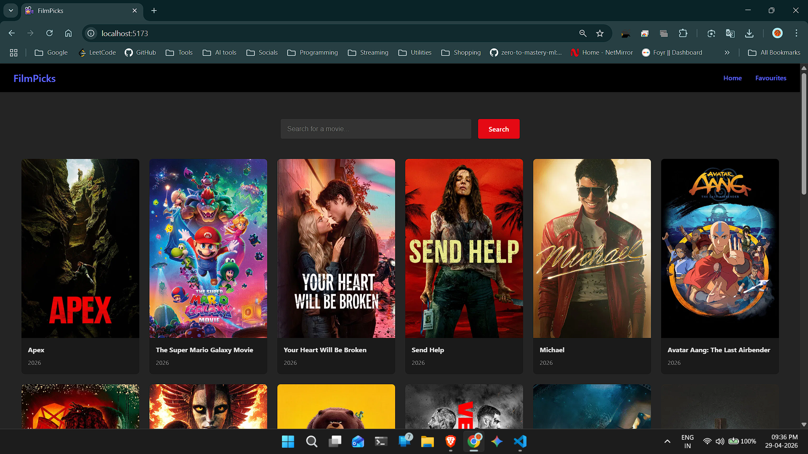
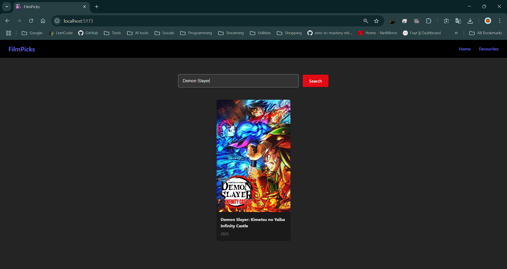
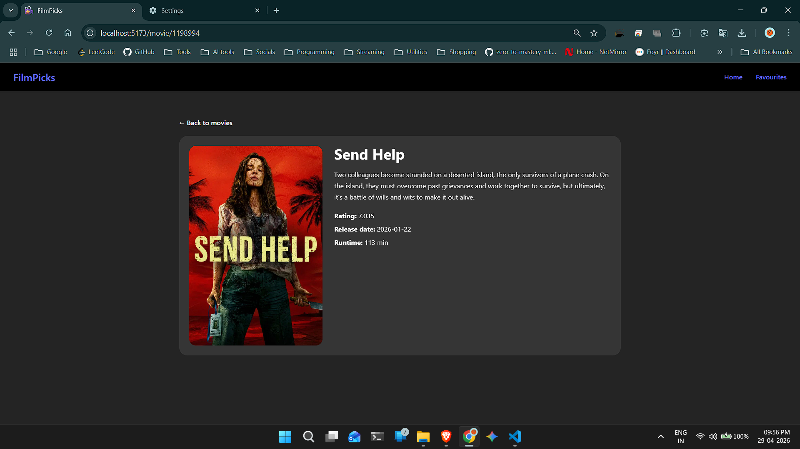
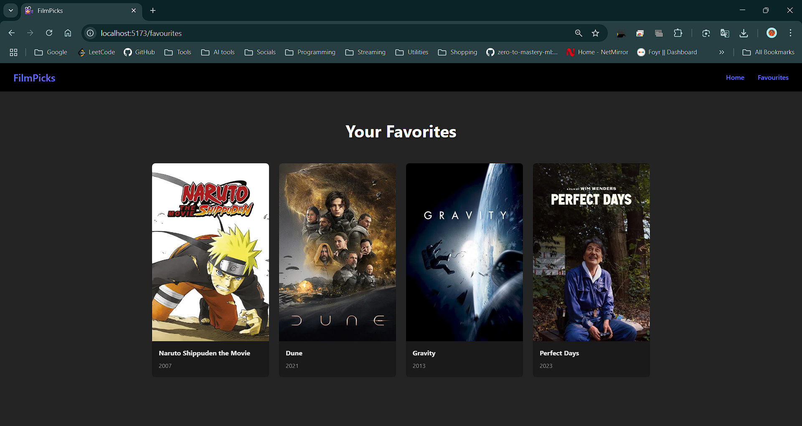

# Movie Search Engine

A React-based movie search app that lets users search for movies, view details, and manage favorites.

## Features

- Search movies by title
- View movie cards in a responsive grid
- Add and remove movies from favorites
- Favorites page for saved movies
- Toast notifications for user feedback

## Screenshots






## Project Structure

- `frontend/` - React frontend
- `frontend/pages/` - Page components
- `frontend/components/` - Reusable UI components
- `frontend/contexts/` - App state and context logic
- `frontend/css/` - Stylesheets

## Getting Started

### Prerequisites

- Node.js
- npm or yarn

### Install dependencies

```bash
cd frontend
npm install
```

### Run the app

```bash
npm run dev
```

## Notes

The `Favorites` page shows saved movies from the shared movie context.  
If there are no favorites, an empty state message is shown.

## TMDB API Key Setup

This project uses [The Movie Database (TMDB)](https://www.themoviedb.org/) API.

1. Create a free TMDB account.
2. Generate an API key from your TMDB account settings.
3. Create a `.env` file inside the `frontend/` folder.
4. Add your key:

```env
VITE_TMDB_API_KEY=your_tmdb_api_key_here
```

## Important

- Do not commit your real API key to version control.
- Use your own TMDB API key for the app to work correctly.

